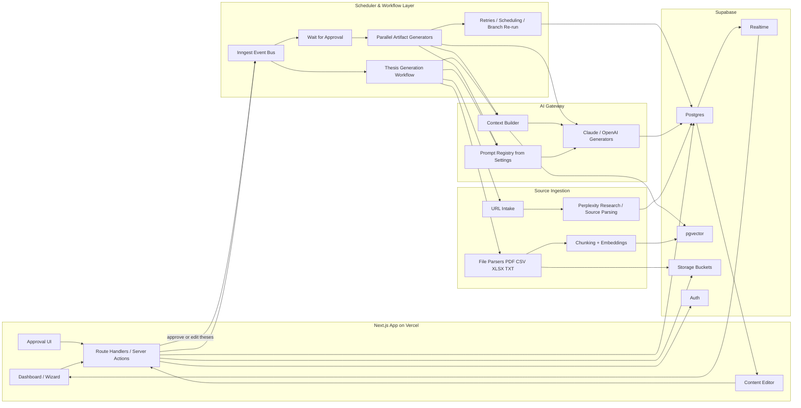

# Webinar Funnel AI Platform

Internal AI-powered platform for automated generation of webinar funnels and marketing artifacts. The system takes a webinar topic, date, and source materials as input, and produces a complete set of marketing and presentation assets — from landing page briefs to email sequences to slide decks.

---

## Product Goal

Webinar funnels require dozens of coordinated content pieces: landing pages, email chains, messenger sequences, presentation slides, gifts, and follow-up campaigns. Creating these manually takes days and involves repetitive work across formats.

This platform automates the generation pipeline. A user defines the webinar topic, provides source materials (URLs, documents, past webinar data), and the system produces all artifacts in parallel — each independently editable, regenerable, and version-tracked.

**This is an internal tool, not a public SaaS.** The priority is speed of delivery, low infrastructure cost, and a workflow that fits the existing team process.

---

## User Flow

```
1. CREATE WEBINAR
   User enters: topic, date, target audience, source URLs, uploaded files

2. INGESTION
   System parses URLs via Perplexity research API
   System parses uploaded files (PDF, CSV, XLSX, TXT)
   Content is chunked, embedded, and stored for retrieval

3. THESIS GENERATION
   AI generates webinar thesis ideas based on ingested context
   User reviews, edits, reorders, or regenerates theses

4. APPROVAL
   User approves final thesis set
   This is an explicit gate — nothing else generates until approval

5. PARALLEL ARTIFACT GENERATION
   After approval, all artifact types generate in parallel:
   - Gift ideas + gift copy + visual briefs
   - Landing page brief (based on structure template)
   - Thank-you page copy
   - Attendance chain (registration confirmation, warmup, day-of, during, post-webinar)
   - Presentation brief (intro ~10 slides, content ~50 slides, sales ~30 slides)

6. REVIEW & EDIT
   Each artifact has its own status (pending / generating / ready / error)
   User can open any artifact and edit its generated text inline
   Edits are saved as a new version without triggering regeneration of other branches
   Each artifact can be regenerated independently — regeneration replaces content but preserves edit history
   Each maintains full version history (both AI-generated and manually edited versions)
```

### Key Workflow Properties

- **Branched generation**: artifacts are independent branches off the approved thesis. Regenerating one does not invalidate others.
- **Version tracking**: every generation produces a new version. Users can compare and revert.
- **Inline editing**: all generated text — presentation briefs, email sequences, landing page copy, gift descriptions — is editable directly in the UI. Manual edits create a new version. The editor supports the full content of each artifact type (structured text, not just plain strings).
- **Custom prompts**: each artifact type has a configurable prompt in Settings. Power users can tune generation behavior per artifact type.
- **Knowledge base**: users upload reference materials (past webinar transcripts, analytics exports, PDFs) that feed into context for all generations.

---

## Architecture Decision

### What we use and why

| Layer | Choice | Rationale |
|-------|--------|-----------|
| **Frontend + BFF** | Next.js 14+ App Router | Single deployable unit on Vercel. Server Actions and Route Handlers act as BFF — no separate API server needed. |
| **Database** | Supabase Postgres | Managed Postgres with built-in Auth, Realtime subscriptions, and Storage. One vendor for data, auth, files, and realtime updates. |
| **Vector store** | pgvector (via Supabase) | No separate vector DB. Embeddings live alongside relational data in the same Postgres instance. |
| **File storage** | Supabase Storage | S3-compatible buckets for uploaded PDFs, CSVs, generated assets. |
| **Orchestration** | Inngest | Durable workflow engine that runs on Vercel. Handles retries, scheduling, fan-out, and the approval wait pattern — without managing infrastructure. |
| **ORM** | Drizzle | Type-safe, lightweight, SQL-close. No magic — what you write is what runs. |
| **Validation** | Zod | Runtime validation for API inputs, LLM outputs, and config schemas. Shared between client and server. |
| **Research API** | Perplexity | URL research, source grounding, factual context extraction. Used during ingestion to enrich source material. |
| **Content generation** | Claude (Anthropic) / OpenAI | Final artifact generation. Model choice is per-artifact-type configurable in Settings. |

### What we explicitly do NOT use in v1 and why

| Rejected option | Why not |
|----------------|---------|
| **FastAPI / Python backend** | Adds a second runtime, a second deploy target, and cross-language type drift. Next.js Route Handlers + Server Actions cover all BFF needs. If Python is needed later for ML pipelines, it can be added as a separate service. |
| **Temporal** | Enterprise-grade workflow engine with significant operational overhead (requires a Temporal server cluster). Inngest provides the same durable workflow primitives (retries, fan-out, wait-for-event, scheduling) as a managed service with zero infrastructure. |
| **Microservice architecture** | Premature for an internal tool with a single team. A monorepo with clear module boundaries gives us the same separation of concerns without network overhead, deployment orchestration, or distributed debugging. |
| **Separate queue + scheduler** | Inngest is both. Adding Redis/BullMQ + a cron service is unnecessary complexity when Inngest handles event-driven workflows, scheduled runs, and retry logic out of the box. |
| **Email/messenger sending** | v1 generates content only. Actual delivery is out of scope — content is exported or copy-pasted into existing tools. Sending infrastructure (SendGrid, Mailgun, messenger APIs) will be added in v2 if validated. |
| **Live webinar integration** | v1 does not connect to webinar platforms (WebinarJam, Zoom, etc.). "During webinar" messages are generated from theses and presentation structure, not from live events. |

---

## System Architecture



---

## Artifact Types

The platform generates the following artifact types after thesis approval. **Every artifact's generated text is editable inline** — users can modify any content directly in the UI before exporting. Edits are versioned alongside AI-generated outputs.

### 1. Webinar Theses
Generated during ingestion phase. These are the core ideas the webinar will cover. User must approve before any other generation begins.

### 2. Gift Ideas
Ideas for attendance incentives (PDFs, checklists, templates, etc.). Each gift idea includes:
- Gift concept and title
- Full copy/text for the gift
- Visual brief for design team

### 3. Landing Page Brief
Structured brief for the webinar registration page. Based on a landing page structure template. Includes headline, subheadline, bullet points, social proof blocks, CTA copy, and speaker bio section.

### 4. Thank-You Page
Separate copy for the post-registration confirmation page. Includes next steps, what to expect, and gift delivery messaging.

### 5. Attendance Chain (Dohodimostj)
A full messaging sequence across email and messenger, broken into stages:

| Stage | Timing | Purpose |
|-------|--------|---------|
| **Registration confirmation** | Immediately after signup | Confirm registration, set expectations. Separate versions for email and messenger. |
| **Warmup sequence** | Days before webinar | Build anticipation, deliver value, reduce no-shows. |
| **Day-of reminders** | Webinar day | Time-based reminders with increasing urgency. |
| **During webinar** | During broadcast | In v1: generated from theses and slide structure, not live events. Engagement hooks, key takeaway teasers. |
| **Post-webinar** | After broadcast | Objection handling, replay access, CTA to application/purchase. |

### 6. Presentation Brief
Structured brief for the webinar slide deck, divided into three sections:

| Section | ~Slides | Content |
|---------|---------|---------|
| **Intro** | ~10 | Speaker intro, agenda, promise, audience warmup |
| **Content** | ~50 | Core teaching, frameworks, examples, proof points |
| **Sales** | ~30 | Offer reveal, objection handling, bonuses, CTA, urgency |

### 7. Settings / Prompt Registry
Each artifact type has a dedicated prompt that can be customized by the user. This allows fine-tuning generation style, tone, length, and structure per artifact without code changes.

### 8. Knowledge Base
User-uploaded reference materials that serve as persistent context:
- PDF documents
- CSV / XLSX spreadsheets (past webinar analytics, conversion data)
- Transcriptions of past webinars
- Any text-based reference material

Uploaded files are parsed, chunked, embedded, and stored in pgvector for retrieval during generation.

---

## Project Structure (Target)

```
webinar-platform/
├── src/
│   ├── app/                    # Next.js App Router pages
│   │   ├── (dashboard)/        # Main dashboard routes
│   │   ├── (auth)/             # Auth routes
│   │   ├── api/                # Route Handlers
│   │   │   └── inngest/        # Inngest webhook endpoint
│   │   └── layout.tsx
│   ├── components/             # React components
│   │   ├── ui/                 # Base UI primitives
│   │   └── features/           # Feature-specific components
│   ├── lib/
│   │   ├── db/                 # Drizzle schema, queries, migrations
│   │   ├── ai/                 # AI gateway, prompt registry, context builder
│   │   ├── ingestion/          # URL + file parsers, chunking, embeddings
│   │   ├── inngest/            # Inngest functions and event definitions
│   │   └── supabase/           # Supabase client, storage helpers
│   ├── types/                  # Shared TypeScript types
│   └── config/                 # App config, feature flags
├── supabase/
│   └── migrations/             # SQL migrations
├── drizzle.config.ts
├── next.config.ts
├── package.json
└── .env.local                  # API keys (not committed)
```

---

## v1 Scope Boundaries

**In scope:**
- Webinar creation wizard with topic, date, sources
- URL ingestion via Perplexity
- File upload and parsing (PDF, CSV, XLSX, TXT)
- Embedding and vector storage for RAG
- Thesis generation and approval workflow
- Parallel generation of all artifact types
- Per-artifact status tracking, versioning, and regeneration
- Inline editing of all generated content with version tracking
- Configurable prompts per artifact type
- Knowledge base with file upload
- Supabase Auth for internal team access
- Realtime status updates via Supabase Realtime

**Out of scope for v1:**
- Email/messenger delivery (generate only, no send)
- Live webinar platform integration
- Multi-tenant / team management
- Billing or usage tracking
- Public-facing pages or embeds
- CI/CD pipeline (manual Vercel deploys are fine for v1)

---

## Environment Variables

```bash
# Supabase
NEXT_PUBLIC_SUPABASE_URL=
NEXT_PUBLIC_SUPABASE_ANON_KEY=
SUPABASE_SERVICE_ROLE_KEY=

# AI Providers
ANTHROPIC_API_KEY=
OPENAI_API_KEY=
PERPLEXITY_API_KEY=

# Inngest
INNGEST_EVENT_KEY=
INNGEST_SIGNING_KEY=

# App
NEXT_PUBLIC_APP_URL=http://localhost:3000
```

---

## Getting Started

```bash
# Install dependencies
pnpm install

# Set up environment
cp .env.example .env.local
# Fill in API keys

# Run Supabase locally (optional)
npx supabase start

# Run Inngest dev server
npx inngest-cli@latest dev

# Run the app
pnpm dev
```

---

## License

Internal use only. Not open source.
